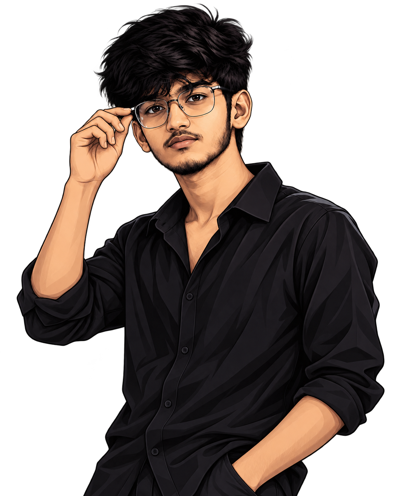

<!-- ===================== HERO ===================== -->

 <h1 align="center">
  Hi, I'm Sai Ganesh 👋
</h1>

### Full Stack Developer · AI Enthusiast · CSE Student

I build modern web applications, experiment with AI, and turn ideas into real-world products.

Always curious. Always building. Always learning.

 

<!-- ===================== ABOUT + STACK ===================== -->

<table>
<tr>

<td width="52%" valign="top">

## 👤 About Me

🎓 CSE Student at **SRM Institute of Science and Technology**

💻 Focused on **Full Stack Development & AI**

🧠 Currently learning:

**System Design · Backend · AI Integration · DSA**

🚀 I like taking projects through:

**Idea → Design → Development → Deployment**

📍 Hosur, India

🎯 Goal:

Build products that are **useful, fast, clean and enjoyable to use.**

</td>

<td width="48%" valign="top">

## 🧊 Tech Stack

### Languages

### Frameworks / Libraries

### Databases / Backend

### Tools

</td>

</tr>
</table>

---

# 📁 Featured Projects

<table>
<tr>

<td width="33%" valign="top">

### 💚 Personal Finance

Finance platform for managing accounts, transactions, budgets and financial insights.

**Built With**

`Next.js` `TypeScript`

`Supabase` `PostgreSQL`

 

</td>

<td width="33%" valign="top">

### 🏍️ RideSense

AI motorcycle safety system with proximity detection, blind-spot alerts and haptic warnings.

**Built With**

`ESP32` `C++`

`Embedded` `IoT`

 

</td>

<td width="33%" valign="top">

### 🎬 CINEWorld

Movie discovery platform with authentication, favorites, watchlists and media exploration.

**Built With**

`React` `Flask`

`Supabase` `SQLAlchemy`

 

</td>

</tr>
</table>

[**View all repositories →**](https://github.com/saiganesh-007?tab=repositories)

---

# 📊 GitHub Stats

  

  

---

---

# 📈 Activity

---

# 🐍 Contribution Snake

> **Keep building. Keep growing.**

---

# 🤝 Let's Connect

Feel free to reach out for **collaborations, opportunities or just a chat!**

---

### `BUILD` · `LEARN` · `IMPROVE` · `REPEAT`

 

  

### Good Code. Brighter Future. ⚡

